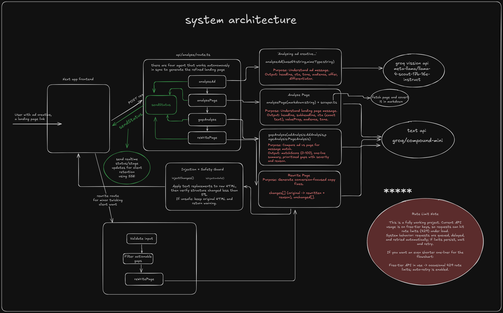
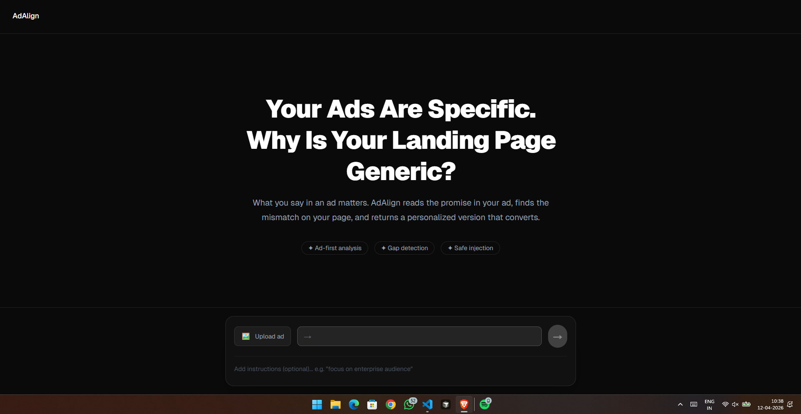
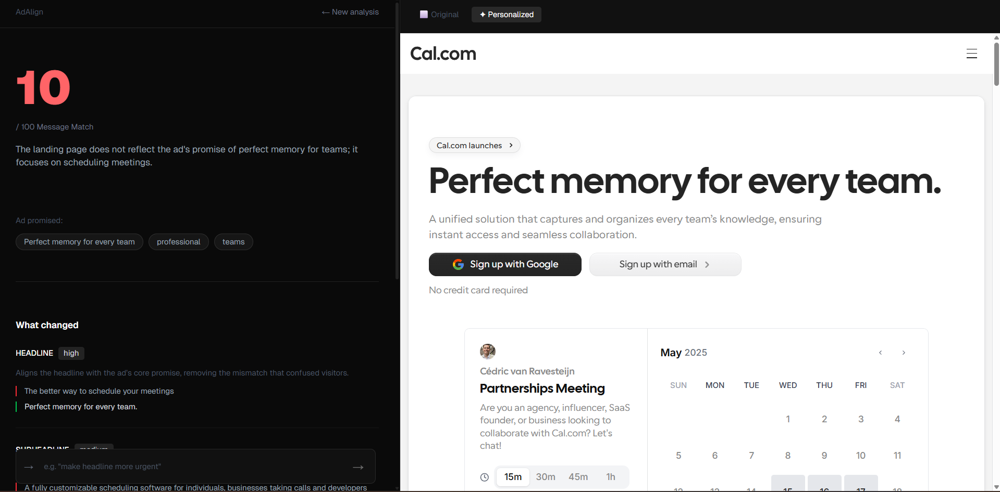
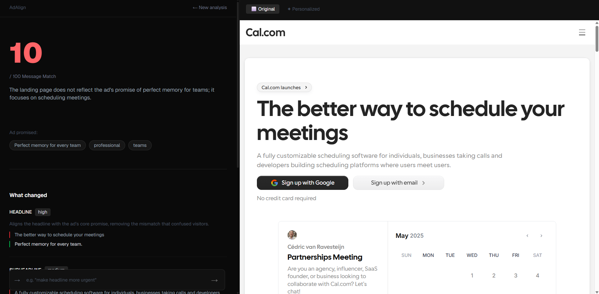

# AdAlign App

AI-powered ad-to-landing-page message matching and rewrite system.

## Overview

This app analyzes an ad creative and a landing page, detects messaging gaps, and generates safe personalized rewrites to improve conversion alignment.

## Architecture Diagram



## Product Screens







## Key Endpoints

- POST /api/analyze
  - Accepts image + URL.
  - Streams status updates using SSE.
  - Returns analyses, gaps, rewrite suggestions, and modified HTML.

- POST /api/rewrite
  - Accepts user tweak instruction and previous analysis context.
  - Produces targeted rewrite updates.
  - Falls back to original HTML if injection is unsafe.

- POST /api/upload
  - Optional Supabase-backed upload path.

## Environment Variables

Create .env.local:

```bash
GROQ_API_KEY=your_groq_api_key

# Optional for upload route
SUPABASE_URL=your_supabase_url
SUPABASE_SERVICE_KEY=your_supabase_service_key

# Optional for supabase helpers
NEXT_PUBLIC_SUPABASE_URL=your_supabase_url
NEXT_PUBLIC_SUPABASE_ANON_KEY=your_supabase_anon_key
```

## Run Locally

```bash
pnpm install
pnpm dev
```

Open http://localhost:3000.

## Reliability Notes

- JSON-only structured outputs with parse retry.
- Retry delay for rate-limited LLM responses.
- HTML safety guard to avoid breaking page structure.
- Progress feedback for both initial run and tweak regeneration.
